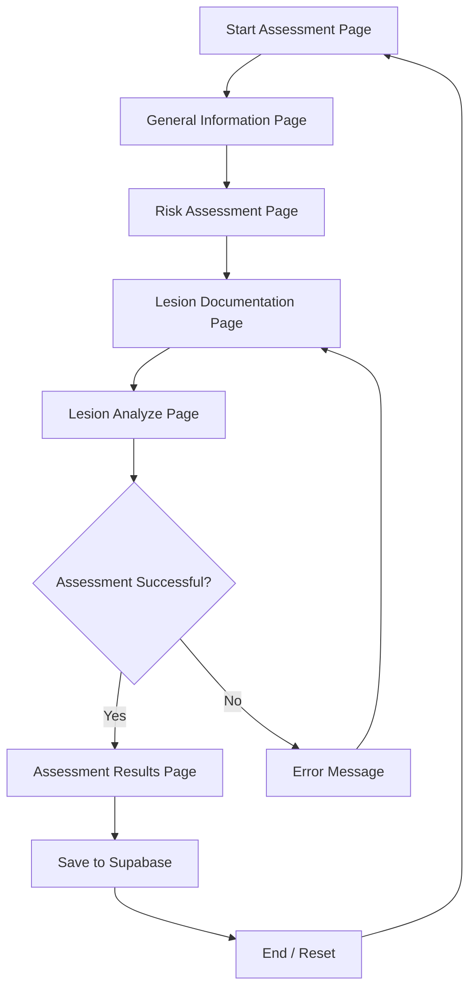

# OPMD Hub AI - Application Flow

## Flow Description

1.  **Start Assessment Page**: The landing page where the user initiates the clinical assessment.
2.  **General Information Page**: Collection of patient demographics (Name, Age, Phone, Region, Nation).
3.  **Risk Assessment Page**: Questionnaire regarding lifestyle habits (Tobacco, Smoking, etc.).
4.  **Lesion Documentation Page**: Interface for uploading clear photos of the oral lesion.
5.  **Lesion Analyze Page**: The AI processing state where Gemini analyzes the visual and clinical data.
6.  **Decision Point**: 
    *   **Success**: The AI provides a provisional diagnosis and risk score.
    *   **Failure**: An error occurs (e.g., API timeout or missing data), prompting a retry at the documentation step.
7.  **Assessment Results Page**: Detailed report with diagnosis, risk score, and recommendations.
8.  **Supabase Integration**: Results are automatically logged to the database for clinical record-keeping.
